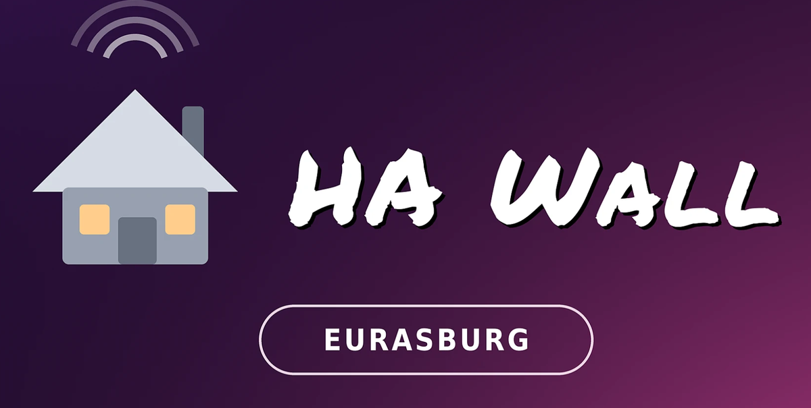

<p align="center">
  
</p>

# HA Wall Eurasburg

Ein Wandpanel für Home Assistant unter Windows, für ein Gerät, das **durchläuft**.

Im Ruhezustand liegt ein Bildschirmschoner: bewegte Farbwolken oder ein eigenes Bild, darauf
wahlweise ein paar Karten — Uhr, Außentemperatur, was du willst. Ein Tipp holt das volle
Dashboard; nach ein paar Minuten ohne Bedienung legt sich der Schoner wieder hin. Nachts wird
der Bildschirm **wirklich abgeschaltet**, Hintergrundbeleuchtung aus, nicht nur schwarz gefärbt.

Abgeleitet von [Italien Wall Display](https://github.com/Max6025/Italien-Hawall), aber ein
eigenständiges Projekt mit eigener Konfiguration und eigenem Update-Kanal. Dort steuert ein
Kalender die Anzeige, weil im Ferienhaus nur zeitweise jemand ist; hier wohnt jemand, und das
dreht fast jede Regel um — siehe [docs/adr/](docs/adr/).

## Was es kann

- **Bildschirmschoner als Ruhezustand** — bewegte Farbwolken ab Werk, wahlweise ein eigenes
  Standbild. Die Karten darauf kommen aus einem Unterdashboard und behalten Größe und Platz
  aus dem Editor
- **Nachtsperre** — Zeitfenster, in dem das Panel wirklich aus ist. Berühren weckt es für zwei
  Minuten, danach legt es sich von selbst wieder hin
- **Mehrere Dashboards** mit Navigations-Karte, automatischem Zurück-Knopf und Rückkehr aufs
  Hauptdashboard nach einer einstellbaren Zeit
- **Karten-Editor im Browser** — auf einem anderen Gerät, nicht am Panel. Kennt die echte
  Panelgröße, damit nichts erst an der Wand auffällt
- **Live-Verbindung zu Home Assistant** über WebSocket: eine Änderung in der HA-App steht in
  Sekundenbruchteilen auf der Wand. Der regelmäßige Abruf bleibt als Netz darunter
- **Live-Ansicht** unter `/live` im Browser — dasselbe Dashboard von unterwegs, ohne
  Bildschirmübertragung
- **Akku-Überwachung** des Geräts mit abgestufter Warnung und Warnton
- **Ankündigungs-Box** über eine `input_text`-Entität
- **Hell/Dunkel-Design**, gesteuert über eine Sonnenstand-Entität, plus Design-Import
- **Updates nur auf Knopfdruck** und nur mit den geänderten Teilen — die Anwendung kontaktiert
  GitHub von sich aus nie

## Installation

Den Installer aus den [Releases](https://github.com/Max6025/Hawall-Eurasburg/releases)
herunterladen und ausführen. Gebaut wird für **64-Bit-Windows (x64)**.

Nach der Installation startet die Anwendung bei jeder Windows-Anmeldung automatisch im
Vollbild. Beim ersten Start trägt sie sich in den Autostart ein, sperrt die Windows-Wischgesten
per Registry und startet dafür einmalig den Explorer neu. `Strg+Alt+Q` beendet sie.

> **Hinweis zum Windows-Konto:** Die Anwendung legt ihre Konfiguration unter dem angemeldeten
> Benutzer ab und trägt sich in dessen Autostart ein. Auf einem Gerät mit Microsoft-Konto
> funktioniert das, ist aber unnötig verwickelt — für ein Wandpanel ist ein **lokales Konto**
> ohne Anmeldekennwort die einfachere Wahl.

## Einrichtung

Die Einrichtung läuft **von einem anderen Gerät aus im Browser**, nicht auf dem Panel selbst.

1. Beim ersten Start zeigt das Display „Bereit zum Einrichten" und seine IP-Adresse
2. Im Browser `http://<IP>:8788/setup/` öffnen
3. Home-Assistant-Adresse und Long-Lived Access Token eintragen
4. Unter **Bildschirmschoner** einstellen, nach wie vielen Minuten er sich hinlegt und was er
   zeigt; unter **Nachtsperre** das Zeitfenster, in dem das Panel aus bleibt

> **Die Einrichtungsseite ist nicht geschützt.** Wer im selben Netz die Adresse kennt, kann
> Dashboards ändern und über Home Assistant Geräte schalten — Licht, Heizung, Tore. Das
> Home-Assistant-Token bleibt auf dem Gerät und geht nie heraus. Wer mehr Schutz braucht, trennt
> das Panel im Router in ein eigenes Netz.

## Wenn du ans Gerät musst

Während der Nachtsperre schaltet ein Wächter den Bildschirm alle fünf Sekunden wieder ab. Es
gibt drei Wege, das für 30 Minuten anzuhalten:

| Weg | Wo | Funktioniert auch |
|---|---|---|
| Fünfmal schnell in die **obere linke Ecke** tippen | am Panel | ohne Tastatur und ohne Netz |
| **Strg+Alt+W** | am Panel | wenn eine Tastatur angeschlossen ist |
| Knopf **30 Minuten pausieren** | Einstellungen → Panel | vom Handy aus |

Die Pause endet von selbst. Berührst du das Panel während der Nachtsperre, weckt es ohnehin
für zwei Minuten auf.

## Dashboards aus dem Italien-Panel übernehmen

Der Import liest das Austauschformat der Vorlage mit. Ein dort exportiertes Dashboard lässt
sich unter **Unterdashboards → Importieren** direkt einspielen; nichts muss von Hand geändert
werden. Umgekehrt geht es nicht zuverlässig — hier gibt es Kartenarten nicht mehr, die dort
existieren.

## Entwicklung

```bash
npm install
npm test
```

Die Tests laufen ohne Electron, ohne Home Assistant und ohne das Gerät — auch unter Linux;
vier Tests, die einen echten PowerShell-Prozess brauchen, werden dort übersprungen.

Den Bildschirmschoner kannst du ohne Gerät ansehen:
`.scratch/karten-design/schoner-probe.html` im Browser öffnen. Er legt sich dort nach fünf
Sekunden statt nach Minuten hin; `?hell` zeigt das helle Design, `?bild` ein Standbild statt
der Wolken.
